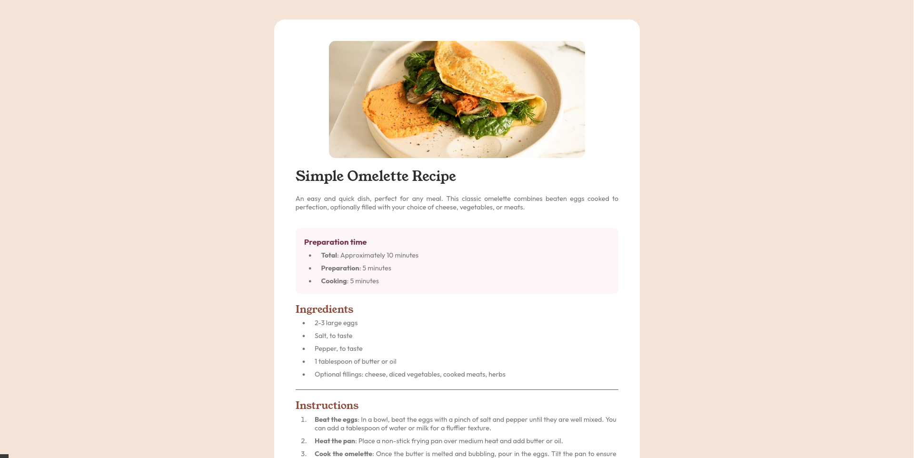

# Recipe page solution

This is a solution to the [Recipe page challenge on Frontend Mentor](https://www.frontendmentor.io/challenges/recipe-page-KiTsR8QQKm). Frontend Mentor challenges help you improve your coding skills by building realistic projects. 

## Table of contents

- [Overview](#overview)
  - [Screenshot](#screenshot)
- [My process](#my-process)
  - [Built with](#built-with)
  - [What I learned](#what-i-learned)
  - [Continued development](#continued-development)


## Overview

### Screenshot



## My process

### Built with

- Semantic HTML5 markup
- CSS properties
- Flexbox

### What I learned

Currently, I'm getting back into coding on the frontend, which I'm not particularly fond of, but I have a lot of fun doing it. I decided to start with this simple project using basic CSS and HTML. I remembered many things I had forgotten and ended up really liking the result. I reviewed a lot about Flexbox and the semantics of HTML and CSS in this project. For example, centering a div, which took me a while to remember:

```css
.main-container {
    background-color: white;
    display: flex;
    justify-content: center;
    flex-direction: column;
    text-align: justify;
    width: 40%;
    margin: 50px;
    padding: 10px;
    border-radius: 25px;
}

```

In HTML, I began to understand more about class organization and how to structure the relationships of each tag for editing in CSS:

```html
    <div class="preparation-container">
        <h3>Preparation time</h3>
        <ul class="preparation-list">
            <li><b>Total</b>: Approximately 10 minutes</li>
            <li><b>Preparation</b>: 5 minutes</li>
            <li><b>Cooking</b>: 5 minutes</li>
        </ul>
    </div>
    <div class="ingredients-container">
        <h2 class="title">Ingredients</h2>
        <ul class="ingredients-list">
            <li>2-3 large eggs</li>
            <li>Salt, to taste</li>
            <li>Pepper, to taste</li>
            <li>1 tablespoon of butter or oil</li>
            <li>Optional fillings: cheese, diced vegetables, cooked meats, herbs</li>
        </ul>
    </div>
```

### Continued development

I would like to focus more on the organization of divs, code refactoring, and best practices for naming classes and the correct use of divs and containers.